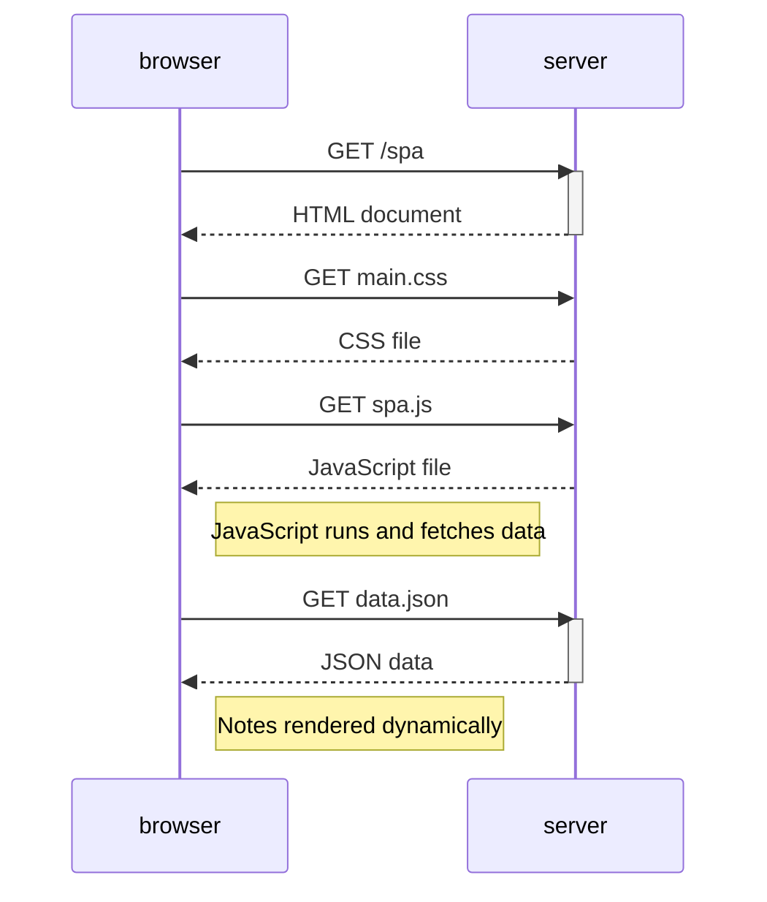

```mermaid
sequenceDiagram
    participant browser
    participant server

    browser->>server: GET /spa
    activate server
    server-->>browser: HTML document
    deactivate server

    browser->>server: GET main.css
    server-->>browser: CSS file

    browser->>server: GET spa.js
    server-->>browser: JavaScript file

    Note right of browser: JavaScript runs and fetches data

    browser->>server: GET data.json
    activate server
    server-->>browser: JSON data
    deactivate server

    Note right of browser: Notes rendered dynamically
```
